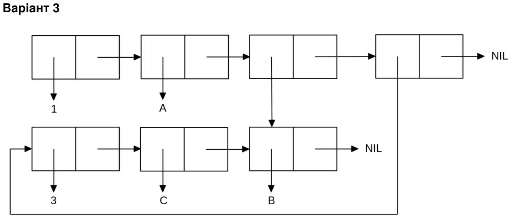

<p align="center"><b>МОНУ НТУУ КПІ ім. Ігоря Сікорського ФПМ СПіСКС</b></p>

<p align="center">
<b>Звіт з лабораторної роботи 1</b><br/>
"Обробка списків з використанням базових функцій"<br/>
дисципліни "Вступ до функціонального програмування"
</p>

<p align="right"><b>Студент</b>: Мануйлов Денис Денисович</p>
<p align="right"><b>Рік</b>: 2025</p>

## 1.1.1 Загальне завдання
```lisp

;; №1
CL-USER> (set 'a (list '|hello there| 4 '(2 3) '(nil)))
(|hello there| 4 (2 3) (NIL))

CL-USER> (defparameter *b* (cons '|hello there| (cons 4 (cons '(2 3) (cons '(nil) nil)))) "Список через cons")
(print *b*)
(|hello there| 4 (2 3) (NIL)) 

;; №2
CL-USER> (car a)
|hello there|

;; №3
CL-USER> (cdr *b*)
(4 (2 3) (NIL))

;; №4
CL-USER> (car (cdr (cdr a)))
(2 3)

CL-USER> (caddr a)
(2 3)

CL-USER> (third a)
(2 3)

;; №5
CL-USER> (last *b*)
((NIL))

CL-USER> (car (reverse *b*))
(NIL)

CL-USER> (nth 4 *b*)
NIL

CL-USER> (cdr (nthcdr 3 *b*))
NIL

;; №6
CL-USER> (atom (car (rest a)))
T

CL-USER> (atom (car (cdr (nthcdr 2 (reverse a)))))
T

CL-USER> (atom (car (nthcdr 2 a)))
NIL

CL-USER> (listp *b*)
T

CL-USER> (listp '(nil))
T

CL-USER> (listp 4)
NIL

;; №7
CL-USER> (let ((x (second a)) (y (second *b*))) (eq x y)) 
T

CL-USER> (eq a *b*) 
NIL

CL-USER> (eql a *b*) 
NIL

CL-USER> (eq (equal a *b*) (eq (equalp "AAA" "aaa") (equalp 1 1.0)))
T

CL-USER> (let ((x (/= 7 2))(y (numberp 2))) (and x y))
T

CL-USER> (listp a)
T

;; №8
CL-USER> (append a (caddr a)) 
(|hello there| 4 (2 3) (NIL) 2 3)
```

## Варіант 11

<p align="center">

</p>

```lisp
CL-USER> (set 'lst '(3 c b))
(list 1 'a (list (caddr lst)) lst)
(1 A (B) (3 C B))
```
